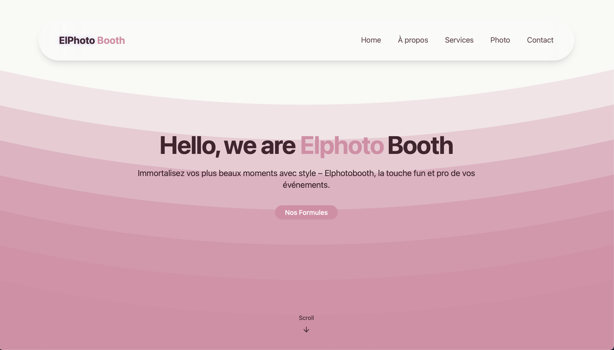

<div align="center">
  <div>
    
    
    
    
    
  </div>
</div>

# 📸 Elphotobooth — Web App

Elphotobooth is a stylish and responsive portfolio website built with **React**, **Tailwind CSS**, and **Vite**.
It showcases a photobooth service with smooth animations, elegant visuals, and a playful interactive experience.



---

## ✨ Features

- 🎨 Aurora-inspired animated background
- 📱 Responsive layout for all devices
- 💡 Lucide icons + Radix UI integration
- 🧼 Clean and modern component-based structure
- 📸 Interactive image section with call-to-action

---

## 🚀 Getting Started

```bash
git clone https://github.com/yourusername/elphotobooth.git
cd elphotobooth
npm install
npm run dev
```

---

## 📦 Build

```bash
npm run build
```

---

## 🧪 Tech Stack

- **React**
- **Tailwind CSS**
- **Vite**
- **Lucide Icons**
- **Radix UI**

---

## 🔗 Live Preview

[➡️ See it live](https://roaring-croissant-3a6703.netlify.app)

---
